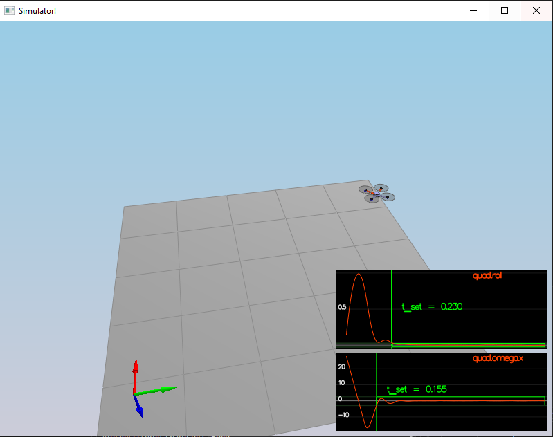
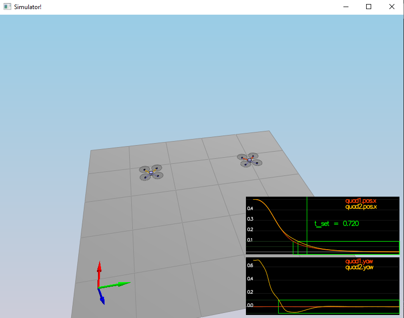
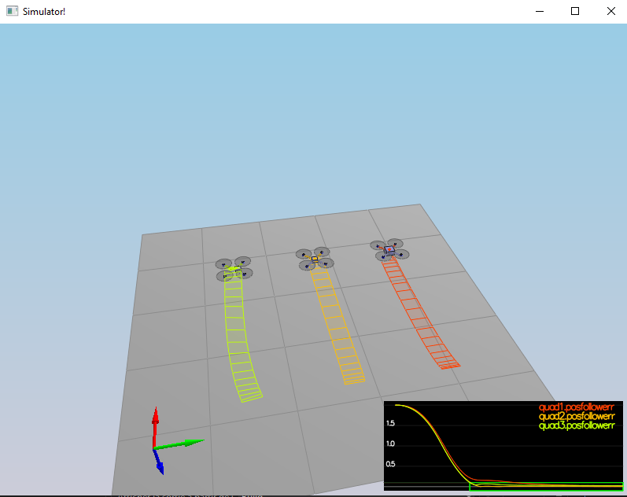
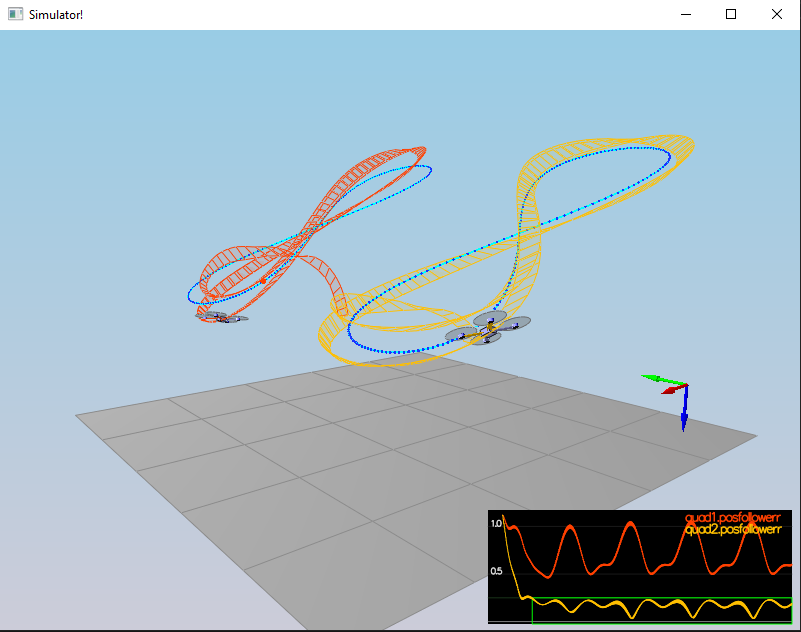

# Building a Controler

## Generate Motor Command

The following function update the command variable with a computed motor command based on the desired moment command following each axis and the general thrust inside the body frame.

```
VehicleCommand QuadControl::GenerateMotorCommands(float collThrustCmd, V3F momentCmd)
{
  // Convert a desired 3-axis moment and collective thrust command to 
  //   individual motor thrust commands
  // INPUTS: 
  //   collThrustCmd: desired collective thrust [N]
  //   momentCmd: desired rotation moment about each axis [N m]
  // OUTPUT:
  //   set class member variable cmd (class variable for graphing) where
  //   cmd.desiredThrustsN[0..3]: motor commands, in [N]

  // HINTS: 
  // - you can access parts of momentCmd via e.g. momentCmd.x
  // You'll need the arm length parameter L, and the drag/thrust ratio kappa

  ////////////////////////////// BEGIN STUDENT CODE ///////////////////////////
    const float l = L / sqrtf(2.f);

    float t1 = momentCmd.x / l;
    float t2 = momentCmd.y / l;
    float t3 = momentCmd.z / kappa;
    float t4 = collThrustCmd;

    cmd.desiredThrustsN[0] = CONSTRAIN((t1 + t2 - t3 + t4) / 4.f ,minMotorThrust, maxMotorThrust);  // front left - f1
    cmd.desiredThrustsN[1] = CONSTRAIN((-t1 + t2 + t3 + t4) / 4.f ,minMotorThrust, maxMotorThrust); // front right - f2
    cmd.desiredThrustsN[2] = CONSTRAIN((t1 - t2 + t3 + t4) / 4.f ,minMotorThrust, maxMotorThrust); // rear left - f4
    cmd.desiredThrustsN[3] = CONSTRAIN((-t1 - t2 - t3 + t4) / 4.f ,minMotorThrust, maxMotorThrust); // rear right - f3

  /////////////////////////////// END STUDENT CODE ////////////////////////////

  return cmd;
}
```

## Implemented body rate control

The implementation of the body rate control is a proportional loop controler. 

```
V3F QuadControl::BodyRateControl(V3F pqrCmd, V3F pqr)
{
  // Calculate a desired 3-axis moment given a desired and current body rate
  // INPUTS: 
  //   pqrCmd: desired body rates [rad/s]
  //   pqr: current or estimated body rates [rad/s]
  // OUTPUT:
  //   return a V3F containing the desired moments for each of the 3 axes

  // HINTS: 
  //  - you can use V3Fs just like scalars: V3F a(1,1,1), b(2,3,4), c; c=a-b;
  //  - you'll need parameters for moments of inertia Ixx, Iyy, Izz
  //  - you'll also need the gain parameter kpPQR (it's a V3F)

  V3F momentCmd;

  ////////////////////////////// BEGIN STUDENT CODE ///////////////////////////

  V3F rate_error = pqrCmd - pqr;

  momentCmd = V3F(Ixx, Iyy, Izz) * kpPQR * rate_error;

  /////////////////////////////// END STUDENT CODE ////////////////////////////

  return momentCmd;
}
```


## Implement roll/pitch control in C++

The roll/pitch controler take acceleration command then translate it in roll/pitch command. From roll/pitch command we apply the transformation to body rate as input for the the body rate controler.
This controler is also a simple proportional controler.
```
V3F QuadControl::RollPitchControl(V3F accelCmd, Quaternion<float> attitude, float collThrustCmd)
{
  // Calculate a desired pitch and roll angle rates based on a desired global
  //   lateral acceleration, the current attitude of the quad, and desired
  //   collective thrust command
  // INPUTS: 
  //   accelCmd: desired acceleration in global XY coordinates [m/s2]
  //   attitude: current or estimated attitude of the vehicle
  //   collThrustCmd: desired collective thrust of the quad [N]
  // OUTPUT:
  //   return a V3F containing the desired pitch and roll rates. The Z
  //     element of the V3F should be left at its default value (0)

  // HINTS: 
  //  - we already provide rotation matrix R: to get element R[1,2] (python) use R(1,2) (C++)
  //  - you'll need the roll/pitch gain kpBank
  //  - collThrustCmd is a force in Newtons! You'll likely want to convert it to acceleration first

  V3F pqrCmd;
  Mat3x3F R = attitude.RotationMatrix_IwrtB();

  ////////////////////////////// BEGIN STUDENT CODE ///////////////////////////

  if (collThrustCmd > 0) {
      float c = -collThrustCmd / mass;
      float b_x, b_y;
      float b_x_d, b_y_d;
      b_x = CONSTRAIN((accelCmd.x / c), -sin(maxTiltAngle), sin(maxTiltAngle));
      b_y = CONSTRAIN((accelCmd.y / c), -sin(maxTiltAngle), sin(maxTiltAngle));
      b_x_d = kpBank * (b_x - R(0, 2));
      b_y_d = kpBank * (b_y - R(1, 2));
      pqrCmd.x = (R(1, 0) * b_x_d - R(0, 0) * b_y_d) / R(2, 2);
      pqrCmd.y = (R(1, 1) * b_x_d - R(0, 1) * b_y_d) / R(2, 2);
  }
  else {
      pqrCmd.x = 0.0;
      pqrCmd.y = 0.0;
  }
  pqrCmd.z = 0;

  /////////////////////////////// END STUDENT CODE ////////////////////////////

  return pqrCmd;
}
```


## Implement altitude controller in C++
The altitude controler is a feedforward PID controler which convert a position and velocity command to an acceleration command.

```
float QuadControl::AltitudeControl(float posZCmd, float velZCmd, float posZ, float velZ, Quaternion<float> attitude, float accelZCmd, float dt)
{
  // Calculate desired quad thrust based on altitude setpoint, actual altitude,
  //   vertical velocity setpoint, actual vertical velocity, and a vertical 
  //   acceleration feed-forward command
  // INPUTS: 
  //   posZCmd, velZCmd: desired vertical position and velocity in NED [m]
  //   posZ, velZ: current vertical position and velocity in NED [m]
  //   accelZCmd: feed-forward vertical acceleration in NED [m/s2]
  //   dt: the time step of the measurements [seconds]
  // OUTPUT:
  //   return a collective thrust command in [N]

  // HINTS: 
  //  - we already provide rotation matrix R: to get element R[1,2] (python) use R(1,2) (C++)
  //  - you'll need the gain parameters kpPosZ and kpVelZ
  //  - maxAscentRate and maxDescentRate are maximum vertical speeds. Note they're both >=0!
  //  - make sure to return a force, not an acceleration
  //  - remember that for an upright quad in NED, thrust should be HIGHER if the desired Z acceleration is LOWER

  Mat3x3F R = attitude.RotationMatrix_IwrtB();
  float thrust = 0;

  ////////////////////////////// BEGIN STUDENT CODE ///////////////////////////

  float zErr = posZCmd - posZ;
  float zDotErr = velZCmd - velZ;

  integratedAltitudeError += zErr * dt;

  accelZCmd = accelZCmd + kpPosZ * zErr + kpVelZ * zDotErr + KiPosZ * integratedAltitudeError;
  
  thrust = -CONSTRAIN((accelZCmd - CONST_GRAVITY) / R(2, 2), -maxDescentRate / dt, maxAscentRate / dt) * mass;


  /////////////////////////////// END STUDENT CODE ////////////////////////////
  
  return thrust;
}
```

## Implement lateral position control in C++

The Lateral position controler is similar to the altitude controler without the integrated term which makes it a PD controler.
```
V3F QuadControl::LateralPositionControl(V3F posCmd, V3F velCmd, V3F pos, V3F vel, V3F accelCmdFF)
{
  // Calculate a desired horizontal acceleration based on 
  //  desired lateral position/velocity/acceleration and current pose
  // INPUTS: 
  //   posCmd: desired position, in NED [m]
  //   velCmd: desired velocity, in NED [m/s]
  //   pos: current position, NED [m]
  //   vel: current velocity, NED [m/s]
  //   accelCmdFF: feed-forward acceleration, NED [m/s2]
  // OUTPUT:
  //   return a V3F with desired horizontal accelerations. 
  //     the Z component should be 0
  // HINTS: 
  //  - use the gain parameters kpPosXY and kpVelXY
  //  - make sure you limit the maximum horizontal velocity and acceleration
  //    to maxSpeedXY and maxAccelXY

  // make sure we don't have any incoming z-component
  accelCmdFF.z = 0;
  velCmd.z = 0;
  posCmd.z = pos.z;

  // we initialize the returned desired acceleration to the feed-forward value.
  // Make sure to _add_, not simply replace, the result of your controller
  // to this variable
  V3F accelCmd = accelCmdFF;

  ////////////////////////////// BEGIN STUDENT CODE ///////////////////////////

  V3F kp_pos;
  kp_pos.x = kpPosXY;
  kp_pos.y = kpPosXY;
  kp_pos.z = 0.f;
  V3F kp_vel;
  kp_vel.x = kpVelXY;
  kp_vel.y = kpVelXY;
  kp_vel.z = 0.f;
  V3F cap_vel_cmd;
  if (velCmd.mag() > maxSpeedXY) {
      cap_vel_cmd = velCmd.norm() * maxSpeedXY;
  }
  else {
      cap_vel_cmd = velCmd;
  }
  accelCmd = kpPosZ * (posCmd - pos) + kpVelZ * (cap_vel_cmd - vel) + accelCmd;
  if (accelCmd.mag() > maxAccelXY) {
      accelCmd = accelCmd.norm() * maxAccelXY;
  }

  /////////////////////////////// END STUDENT CODE ////////////////////////////

  return accelCmd;
}
```

## Implement yaw control in C++

This one is a P with a normalized error ranging from [-pi, pi]. 

```
float QuadControl::YawControl(float yawCmd, float yaw)
{
  // Calculate a desired yaw rate to control yaw to yawCmd
  // INPUTS: 
  //   yawCmd: commanded yaw [rad]
  //   yaw: current yaw [rad]
  // OUTPUT:
  //   return a desired yaw rate [rad/s]
  // HINTS: 
  //  - use fmodf(foo,b) to unwrap a radian angle measure float foo to range [0,b]. 
  //  - use the yaw control gain parameter kpYaw

  float yawRateCmd=0;
  ////////////////////////////// BEGIN STUDENT CODE ///////////////////////////

  float yaw_error = yawCmd - yaw;
  yaw_error = fmodf(yaw_error, 2.0F * F_PI);
  if (yaw_error > F_PI)
  {
      yaw_error -= 2.f * F_PI;
  }
  else if (yaw_error < -F_PI)
  {
      yaw_error += 2.f * F_PI;
  }
  yawRateCmd = kpYaw * yaw_error;

  /////////////////////////////// END STUDENT CODE ////////////////////////////

  return yawRateCmd;

}
```



## Non-idealities and robustness
In a realistic world assumptions and mistakes are often made on the model. Those assumption could lead in consistent error in the model. Also pertubation could prevent the controler to reach the desired state. A solution for this problem is to add an integrated term like we did in the altitude controler.




## Tracking Trajectories

For this one it was required to fine tune the perameters of the positions and altitude controler to be able to track a trajectory. The difficulty was to pass this test without causing any regression regarding the previous tests.


